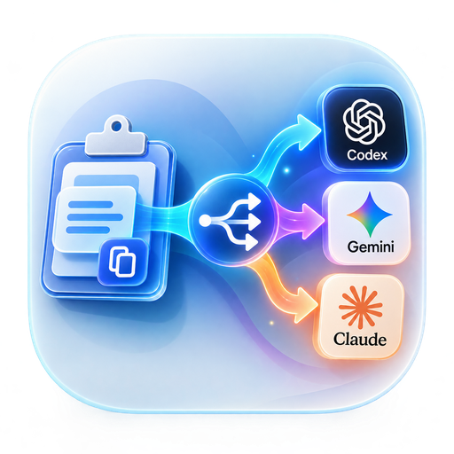

<p align="center">
  
</p>

# AgentCtrlV

**Windows 上 AI Agent 的剪贴板路由器**

把图片/文本以最快速度、最低摩擦、最可靠地送进一个或多个 AI Agent 的输入框。

> 只做粘贴，不内置 AI。

## 核心流程

```
Alt+V → 读剪贴板 → 环形菜单 → 选 Agent → 注入输入框
```

- **Alt+V**：分发当前剪贴板（图片/文本）
- **Alt+S**：截图后分发
- **Alt+Shift+V**：重发上一次 Payload

支持单选 / Ctrl 多选，冷启动新会话 / 热启动当前输入框。

## v0.1 内置 Agent

| Agent | 类型 | 说明 |
|-------|------|------|
| ChatGPT Desktop | GUI | 支持图片 + 文本 |
| Cursor | GUI | 支持图片 + 文本 |
| Windows Terminal | CLI | 仅文本 |

## 快速开始（开发中）

```bash
git clone https://github.com/1parado/AgentCtrlV.git
cd AgentCtrlV

python -m venv .venv
.venv\Scripts\activate
pip install -r requirements.txt

python src/main.py            # 常驻运行
```

### 当前进度：M2（热键 + 环形菜单）

```bash
python src/main.py --check     # 装配自检：Agent 数量 + 热键能否注册
python src/main.py             # 常驻运行（托盘 + 全局热键 + 环形菜单）

python scripts/selftest.py     # M1 链路逐层自检
pytest tests/                  # 单元测试，不碰真实剪贴板
pytest -m integration          # 集成测试，会临时改写剪贴板
```

热键：`Alt+V` 分发剪贴板、`Alt+Shift+V` 重发上一次；托盘菜单是热键被占用时的备用入口。

### Agent 是自己配的

Agent 列表来自 [config/agents/](config/agents/) 下的 YAML（契约见
[docs/CONFIG_SCHEMA.md](docs/CONFIG_SCHEMA.md)）。**哪些进环形菜单由你决定**——
用 `enabled: false` 把暂时用不到（或没装）的挡在菜单外，因为菜单容量有限。

```bash
python scripts/list_windows.py   # 看现状：有哪些窗口、每个 Agent 能不能定位到
```

支持两类目标：

- **GUI Agent**：按进程名 + 窗口标题定位（ZCode、WorkBuddy、Kimi Code、OpenCode…）
- **CLI Agent**：没有自己的窗口，注入目标是**宿主终端**。定位方式是
  「找到真正在跑的那个 CLI 进程 → 顺进程树往上找它的终端窗口」，
  **不靠猜终端标题**（CLI 会动态改写标题，猜错就是把失败伪装成成功）

> ⚠️ 目标程序如果**以管理员权限运行**，Windows 的 UIPI 会拒绝注入。
> AgentCtrlV 会提前识别并明确告知，而不是失败在激活环节给一句含糊的"窗口未能激活"。
> 想注入提权目标，需要 AgentCtrlV 自身也以管理员运行（v0.1 不做支持）。

### 工具

```bash
python scripts/preview_menu.py          # 渲染菜单预览图 menu_preview.png
python scripts/extract_icons.py         # 提取本机各 Agent 的真实图标 -> assets/agents/
python scripts/e2e_real_app.py zcode    # 对真实应用做端到端验证（含截图差比对）
```

> Agent 图标是**从你自己机器上已安装的程序里提取**的，因此不进仓库
> （那是各家的商标资产）。新机器上跑一次 `scripts/extract_icons.py` 即可；
> 没有图标的 Agent 会自动显示字母头像。

> ℹ️ `SendInput` 的返回值**不是**送达证明：它只说明事件被系统接受，没有回执。
> `scripts/selftest.py` 用一个会回报"我收到了什么"的目标窗口来真正判定，
> 并会区分「已派发」与「目标确实收到」。详见
> [docs/ARCHITECTURE.md](docs/ARCHITECTURE.md#注入的可观测性sendinput-的返回值不是送达证明)。

## 开发交接包

本仓库已按 AI Agent 友好方式组织，包含完整交接文档：

| 文件 | 作用 |
|------|------|
| [AGENTS.md](AGENTS.md) | 给 AI 的开发规则（最重要） |
| [docs/PRD.md](docs/PRD.md) | 产品需求与边界 |
| [docs/ARCHITECTURE.md](docs/ARCHITECTURE.md) | 技术架构与状态机 |
| [docs/CONFIG_SCHEMA.md](docs/CONFIG_SCHEMA.md) | 配置契约 |
| [docs/TASKS.md](docs/TASKS.md) | 任务拆分与验收标准 |
| [docs/ACCEPTANCE.md](docs/ACCEPTANCE.md) | 手动验收清单 |
| [config/config.example.yaml](config/config.example.yaml) | 配置样例 |
| [MOCK.md](MOCK.md) | 测试环境说明 |
| [assets/icons/](assets/icons/) | 应用图标（`app.png` / `app.ico` / `app-master.png`） |
| requirements.txt | 精确依赖 |

## 图标资源

| 文件 | 尺寸 | 用途 |
|------|------|------|
| [assets/icons/app.png](assets/icons/app.png) | 512×512 PNG | 托盘图标、窗口图标、README |
| [assets/icons/app.ico](assets/icons/app.ico) | 16/24/32/48/64/128/256 | PyInstaller `--icon`、Windows 任务栏 |
| [assets/icons/app-master.png](assets/icons/app-master.png) | 1254×1254 PNG | 原始母版，重新生成派生尺寸时使用 |

全部带透明通道（RGBA），四角透明，可直接用于托盘与任务栏。
重新生成派生文件（需 Pillow，已在 requirements.txt 中）：

```python
from PIL import Image
m = Image.open("assets/icons/app-master.png").convert("RGBA")
m.resize((512, 512), Image.Resampling.LANCZOS).save("assets/icons/app.png", optimize=True)
sizes = [(16,16), (24,24), (32,32), (48,48), (64,64), (128,128), (256,256)]
f = [m.resize(s, Image.Resampling.LANCZOS) for s in sizes]
f[-1].save("assets/icons/app.ico", format="ICO", sizes=sizes, append_images=f[:-1])
```

## 设计哲学

热键是主路径，监听是辅助；
注入是分层降级，不是单点方案；
会话策略是配置项，不是通用能力；
失败必须可见，不能静默。

## License

MIT
